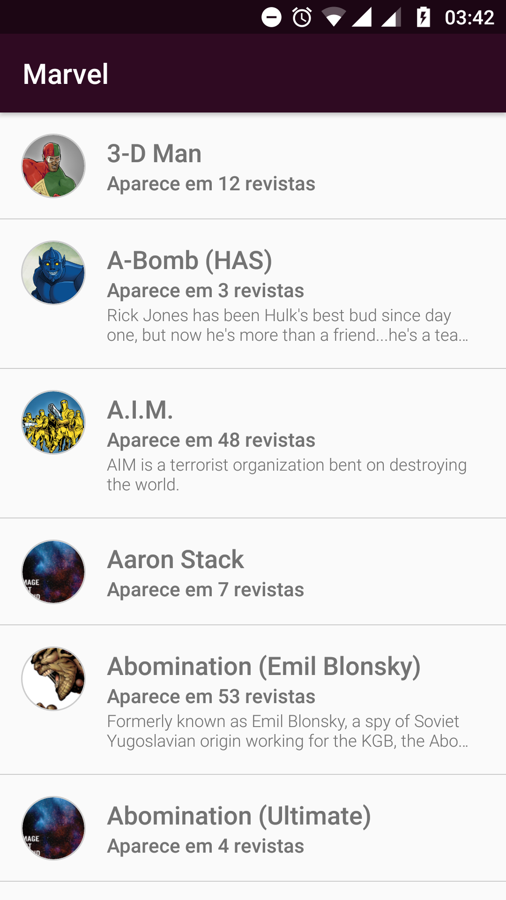
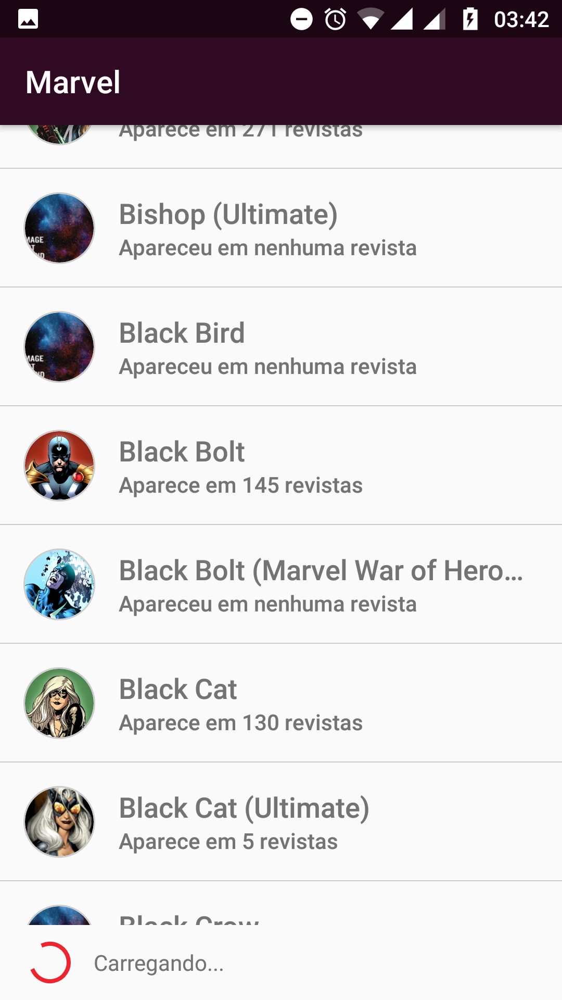
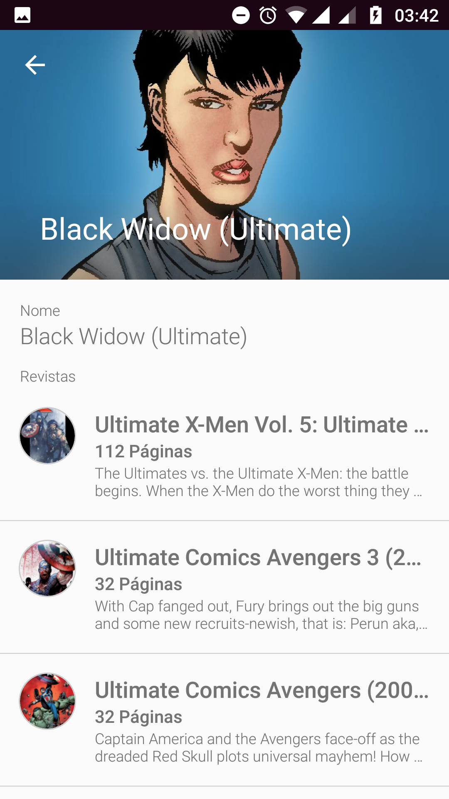
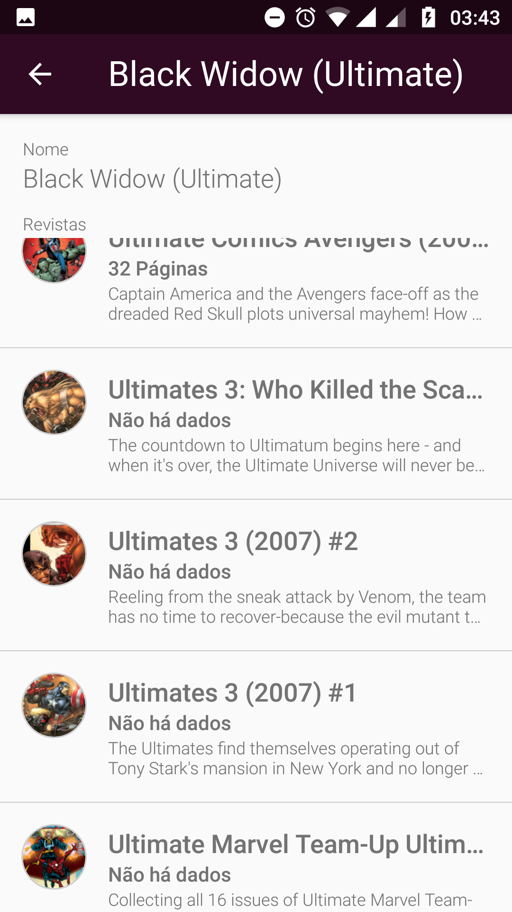

# Marvel Client Application
Código fonte do cliente da Marvel desenvolvido por Wiliam Trancoso.

## Funções da aplicação
#### Exibir lista de personagens

#### Carregar mais personagens conforme move a tela

#### Exibir as revistas que o personagem já participou

--------------------

### Development Tools
* Android Studio v3.1.4
* Android SDK Build Tools v27.1.0
* MinSdkVersion 21
* CompileSDKVersion 27
* Kotlin Version 1.2.70

--------------------

### Dependências
* Android Support Tools v27.1.0
* Koin 0.9.0
* Retrofit v2.4.0
* Glide v4.8.0

--------------------

### TO DO
* Adicionar campo de busca na tela de personagens
* Adicionar [SwipeRefreshLayout](https://developer.android.com/reference/android/support/v4/widget/SwipeRefreshLayout) para carregar mais itens
* Tratar de forma mais eficiente os possíveis erros retornados da API
* Adicionar um icone launcher
* Utilizar [Transition Activity](https://developer.android.com/training/transitions/start-activity) para adicionar um efeito mais sexy de transição de tela
* Exibir detalhes das revistas
